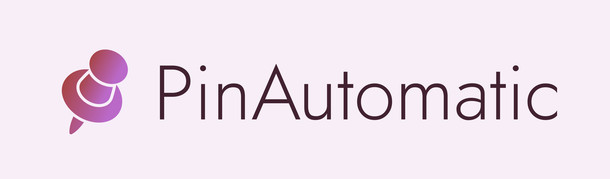
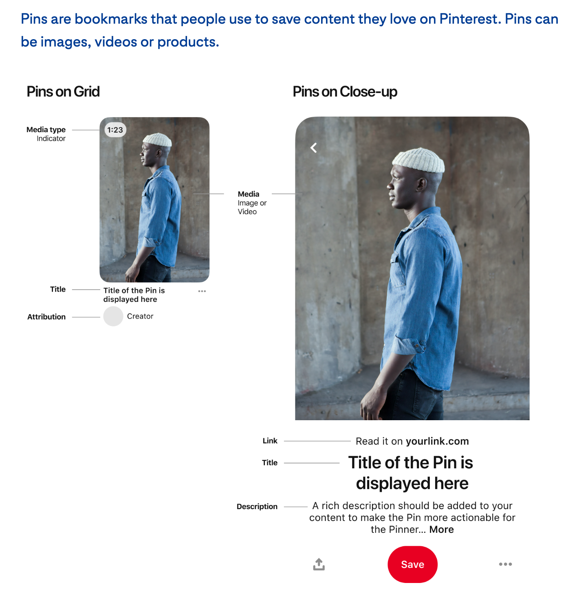

# PinAutomatic
### Pinterest Marketing Made Easy


Pin all images from any URL to your Pinterest Board, auto-magically. &#10024; 

You can also customise the title, link and description of the pin thus making it a great marketing tool.

### But what are Pins / Pinterest?
To know in detail about Pinterest or Pins you can refer their [official docs](https://help.pinterest.com/en-gb/guide/all-about-pinterest). To give an overview, here's a snippet from that doc.



In addition to sharing ideas, Pinterest can be used as a great marketing platform.
As you can see in the image above, every Pin has a title, description and link associated with it. This link can take the user to any URL that you add to the pin.


### Use Cases
There are 2 primary use cases for this app:
  - When you find a website which has many images that you'd like to add to your Pinterest Board, you can use the app to do so, without having to add those pictures one by one.
  - If you run a Brand Page on Pinterest, you can use this app to pin images from your website to your Pinterest page, with your website's link. That way, if a user likes a pin and clicks on it, it takes them to your website.

> Note: The app does not support copying of copyrighted images. So please ensure you have the rights to copy images from the Source URL.

### Usage
  - Register or login to your PinAutomatic account. You need a valid email to register.
  - Authorize PinAutomatic to access your account. To understand why PinAutomatic asks for these permissions refer to the [Pinterest API Docs](https://developers.pinterest.com/docs/api/v5/).
  - Fill the following options:
    - `Source URL`: The website to grab images from
    - `Destination Board`: Name of the destination board where you'd like to pin these images. **Board should already exist in the profile.** Can also be a Secret Board.
    - `Pin Link`: This is the URL a user reaches when he clicks on any pin on your board, ideally your brand's website
    - `Pin Title`: Title of the Pin on Pinterest
    - `Pin Description`: Add any custom description on all pins in your board, can be keywords related to your brand


### Deploying locally
To deploy a local version for development, you first need to [obtain an API token from Pinterest](https://developers.pinterest.com/).
After that follow the following steps:
```bash
git clone git@github.com:AnirudhGoel/PinAutomatic.git
cd PinAutomatic
python3 -m virtualenv venv
source venv/bin/activate
pip install -r requirements.txt
cp env.sample .env
# populate .env file
flask run
```

### Note
This app was initially built using Pinterest API v2 and has come a long way since to v5. With every new version of Pinterest API, it is required to re-register the app and obtain new API credentials. Originally the app was designed to copy pins from any public board to your board, in bulk. But with the new Pinterest API update, which is currently in Beta, Pinterest has removed the functionality to access the pins from other people's boards (even public ones), so the app has now been updated to parse images from any website and not solely rely on Pinterest boards for source pins. This is still experimental. <br> **Update**: The app has been upgraded to have standard access with higher limits (see [Pinterest API Rate Limits](https://developers.pinterest.com/docs/api/v5/#tag/Rate-limits)).


### Demo


### Stargazers over time
[](https://starchart.cc/AnirudhGoel/PinAutomatic)


--------------------------
This app complies completely with [Pinterest Developer's Policy](https://developers.pinterest.com/policy/). If you have any issues contact me via [email](http://scr.im/3hmx).